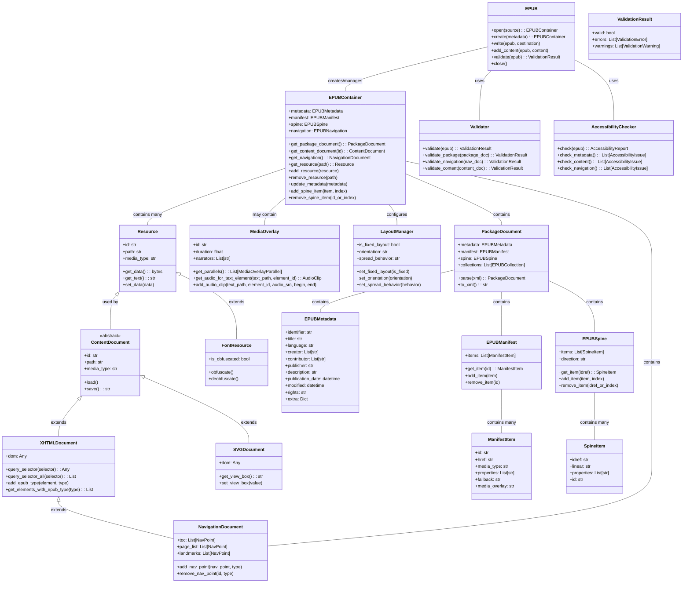

```mermaid
classDiagram
    %% Core Classes
    class EPUB {
        +open(source): EPUBContainer
        +create(metadata): EPUBContainer
        +write(epub, destination)
        +add_content(epub, content)
        +validate(epub): ValidationResult
        +close()
    }

    class EPUBContainer {
        +metadata: EPUBMetadata
        +manifest: EPUBManifest
        +spine: EPUBSpine
        +navigation: EPUBNavigation
        +get_package_document(): PackageDocument
        +get_content_document(id): ContentDocument
        +get_navigation(): NavigationDocument
        +get_resource(path): Resource
        +add_resource(resource)
        +remove_resource(path)
        +update_metadata(metadata)
        +add_spine_item(item, index)
        +remove_spine_item(id_or_index)
    }

    %% Document Components
    class PackageDocument {
        +metadata: EPUBMetadata
        +manifest: EPUBManifest
        +spine: EPUBSpine
        +collections: List[EPUBCollection]
        +parse(xml): PackageDocument
        +to_xml(): str
    }

    class ContentDocument {
        <<abstract>>
        +id: str
        +path: str
        +media_type: str
        +load()
        +save(): str
    }

    class XHTMLDocument {
        +dom: Any
        +query_selector(selector): Any
        +query_selector_all(selector): List
        +add_epub_type(element, type)
        +get_elements_with_epub_type(type): List
    }

    class SVGDocument {
        +dom: Any
        +get_view_box(): str
        +set_view_box(value)
    }

    class NavigationDocument {
        +toc: List[NavPoint]
        +page_list: List[NavPoint]
        +landmarks: List[NavPoint]
        +add_nav_point(nav_point, type)
        +remove_nav_point(id, type)
    }

    %% Media and Layout
    class MediaOverlay {
        +id: str
        +duration: float
        +narrators: List[str]
        +get_parallels(): List[MediaOverlayParallel]
        +get_audio_for_text_element(text_path, element_id): AudioClip
        +add_audio_clip(text_path, element_id, audio_src, begin, end)
    }

    class LayoutManager {
        +is_fixed_layout: bool
        +orientation: str
        +spread_behavior: str
        +set_fixed_layout(is_fixed)
        +set_orientation(orientation)
        +set_spread_behavior(behavior)
    }

    %% Resources
    class Resource {
        +id: str
        +path: str
        +media_type: str
        +get_data(): bytes
        +get_text(): str
        +set_data(data)
    }

    class FontResource {
        +is_obfuscated: bool
        +obfuscate()
        +deobfuscate()
    }

    %% Validation
    class Validator {
        +validate(epub): ValidationResult
        +validate_package(package_doc): ValidationResult
        +validate_navigation(nav_doc): ValidationResult
        +validate_content(content_doc): ValidationResult
    }

    class AccessibilityChecker {
        +check(epub): AccessibilityReport
        +check_metadata(): List[AccessibilityIssue]
        +check_content(): List[AccessibilityIssue]
        +check_navigation(): List[AccessibilityIssue]
    }

    %% Helper Classes
    class EPUBMetadata {
        +identifier: str
        +title: str
        +language: str
        +creator: List[str]
        +contributor: List[str]
        +publisher: str
        +description: str
        +publication_date: datetime
        +modified: datetime
        +rights: str
        +extra: Dict
    }

    class ManifestItem {
        +id: str
        +href: str
        +media_type: str
        +properties: List[str]
        +fallback: str
        +media_overlay: str
    }

    class EPUBManifest {
        +items: List[ManifestItem]
        +get_item(id): ManifestItem
        +add_item(item)
        +remove_item(id)
    }

    class SpineItem {
        +idref: str
        +linear: str
        +properties: List[str]
        +id: str
    }

    class EPUBSpine {
        +items: List[SpineItem]
        +direction: str
        +get_item(idref): SpineItem
        +add_item(item, index)
        +remove_item(idref_or_index)
    }

    class ValidationResult {
        +valid: bool
        +errors: List[ValidationError]
        +warnings: List[ValidationWarning]
    }

    %% Relationships
    EPUB -- EPUBContainer : creates/manages
    EPUBContainer -- PackageDocument : contains
    EPUBContainer -- Resource : contains many
    PackageDocument -- EPUBMetadata : contains
    PackageDocument -- EPUBManifest : contains
    PackageDocument -- EPUBSpine : contains
    EPUBManifest -- ManifestItem : contains many
    EPUBSpine -- SpineItem : contains many
    ContentDocument <|-- XHTMLDocument : extends
    ContentDocument <|-- SVGDocument : extends
    XHTMLDocument <|-- NavigationDocument : extends
    Resource <|-- FontResource : extends
    Resource <|-- ContentDocument : used by
    EPUBContainer -- NavigationDocument : contains
    EPUB -- Validator : uses
    EPUB -- AccessibilityChecker : uses
    EPUBContainer -- MediaOverlay : may contain
    EPUBContainer -- LayoutManager : configures

```
