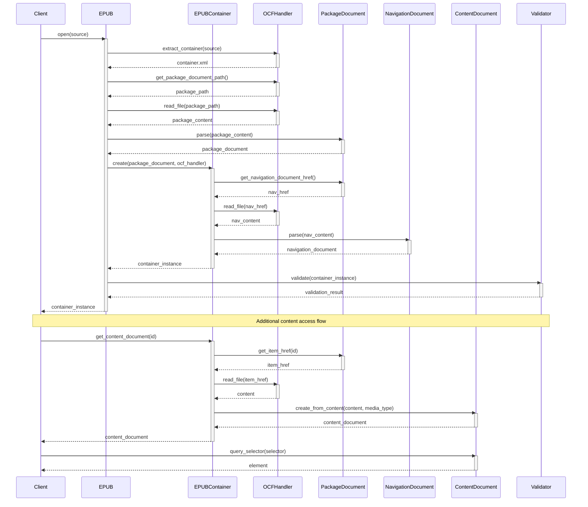

```mermaid
sequenceDiagram
    participant Client
    participant EPUB
    participant EPUBContainer
    participant OCFHandler
    participant PackageDoc as PackageDocument
    participant NavDoc as NavigationDocument
    participant ContentDoc as ContentDocument
    participant Validator

    Client->>EPUB: open(source)
    activate EPUB
    EPUB->>OCFHandler: extract_container(source)
    activate OCFHandler
    OCFHandler-->>EPUB: container.xml
    deactivate OCFHandler

    EPUB->>OCFHandler: get_package_document_path()
    activate OCFHandler
    OCFHandler-->>EPUB: package_path
    deactivate OCFHandler

    EPUB->>OCFHandler: read_file(package_path)
    activate OCFHandler
    OCFHandler-->>EPUB: package_content
    deactivate OCFHandler

    EPUB->>PackageDoc: parse(package_content)
    activate PackageDoc
    PackageDoc-->>EPUB: package_document
    deactivate PackageDoc

    EPUB->>EPUBContainer: create(package_document, ocf_handler)
    activate EPUBContainer

    EPUBContainer->>PackageDoc: get_navigation_document_href()
    activate PackageDoc
    PackageDoc-->>EPUBContainer: nav_href
    deactivate PackageDoc

    EPUBContainer->>OCFHandler: read_file(nav_href)
    activate OCFHandler
    OCFHandler-->>EPUBContainer: nav_content
    deactivate OCFHandler

    EPUBContainer->>NavDoc: parse(nav_content)
    activate NavDoc
    NavDoc-->>EPUBContainer: navigation_document
    deactivate NavDoc

    EPUBContainer-->>EPUB: container_instance
    deactivate EPUBContainer

    EPUB->>Validator: validate(container_instance)
    activate Validator
    Validator-->>EPUB: validation_result
    deactivate Validator

    EPUB-->>Client: container_instance
    deactivate EPUB

    Note over Client,Validator: Additional content access flow

    Client->>EPUBContainer: get_content_document(id)
    activate EPUBContainer
    EPUBContainer->>PackageDoc: get_item_href(id)
    activate PackageDoc
    PackageDoc-->>EPUBContainer: item_href
    deactivate PackageDoc

    EPUBContainer->>OCFHandler: read_file(item_href)
    activate OCFHandler
    OCFHandler-->>EPUBContainer: content
    deactivate OCFHandler

    EPUBContainer->>ContentDoc: create_from_content(content, media_type)
    activate ContentDoc
    ContentDoc-->>EPUBContainer: content_document
    deactivate ContentDoc

    EPUBContainer-->>Client: content_document
    deactivate EPUBContainer

    Client->>ContentDoc: query_selector(selector)
    activate ContentDoc
    ContentDoc-->>Client: element
    deactivate ContentDoc
```
