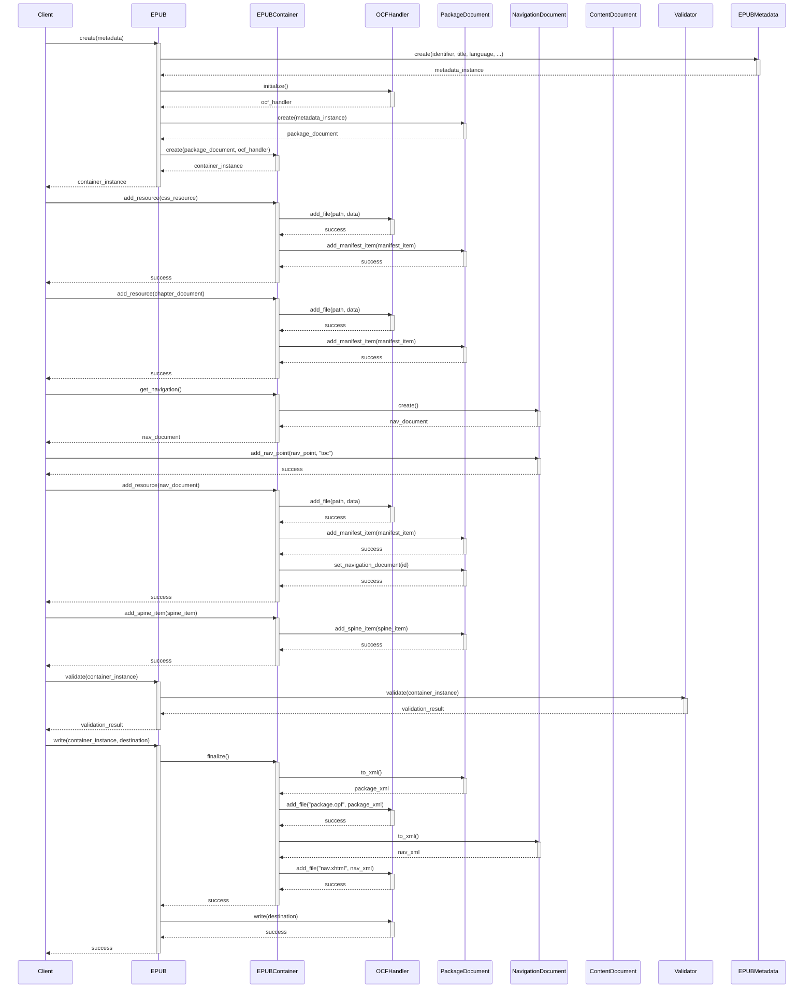

```mermaid
sequenceDiagram
    participant Client
    participant EPUB
    participant EPUBContainer
    participant OCFHandler
    participant PackageDoc as PackageDocument
    participant NavDoc as NavigationDocument
    participant ContentDoc as ContentDocument
    participant Validator

    %% Initialization flow
    Client->>EPUB: create(metadata)
    activate EPUB
    EPUB->>EPUBMetadata: create(identifier, title, language, ...)
    activate EPUBMetadata
    EPUBMetadata-->>EPUB: metadata_instance
    deactivate EPUBMetadata

    EPUB->>OCFHandler: initialize()
    activate OCFHandler
    OCFHandler-->>EPUB: ocf_handler
    deactivate OCFHandler

    EPUB->>PackageDoc: create(metadata_instance)
    activate PackageDoc
    PackageDoc-->>EPUB: package_document
    deactivate PackageDoc

    EPUB->>EPUBContainer: create(package_document, ocf_handler)
    activate EPUBContainer
    EPUBContainer-->>EPUB: container_instance
    deactivate EPUBContainer

    EPUB-->>Client: container_instance
    deactivate EPUB

    %% Adding content
    Client->>EPUBContainer: add_resource(css_resource)
    activate EPUBContainer
    EPUBContainer->>OCFHandler: add_file(path, data)
    activate OCFHandler
    OCFHandler-->>EPUBContainer: success
    deactivate OCFHandler

    EPUBContainer->>PackageDoc: add_manifest_item(manifest_item)
    activate PackageDoc
    PackageDoc-->>EPUBContainer: success
    deactivate PackageDoc
    EPUBContainer-->>Client: success
    deactivate EPUBContainer

    %% Adding a chapter
    Client->>EPUBContainer: add_resource(chapter_document)
    activate EPUBContainer
    EPUBContainer->>OCFHandler: add_file(path, data)
    activate OCFHandler
    OCFHandler-->>EPUBContainer: success
    deactivate OCFHandler

    EPUBContainer->>PackageDoc: add_manifest_item(manifest_item)
    activate PackageDoc
    PackageDoc-->>EPUBContainer: success
    deactivate PackageDoc
    EPUBContainer-->>Client: success
    deactivate EPUBContainer

    %% Creating navigation document
    Client->>EPUBContainer: get_navigation()
    activate EPUBContainer
    EPUBContainer->>NavDoc: create()
    activate NavDoc
    NavDoc-->>EPUBContainer: nav_document
    deactivate NavDoc
    EPUBContainer-->>Client: nav_document
    deactivate EPUBContainer

    Client->>NavDoc: add_nav_point(nav_point, "toc")
    activate NavDoc
    NavDoc-->>Client: success
    deactivate NavDoc

    Client->>EPUBContainer: add_resource(nav_document)
    activate EPUBContainer
    EPUBContainer->>OCFHandler: add_file(path, data)
    activate OCFHandler
    OCFHandler-->>EPUBContainer: success
    deactivate OCFHandler

    EPUBContainer->>PackageDoc: add_manifest_item(manifest_item)
    activate PackageDoc
    PackageDoc-->>EPUBContainer: success
    deactivate PackageDoc

    EPUBContainer->>PackageDoc: set_navigation_document(id)
    activate PackageDoc
    PackageDoc-->>EPUBContainer: success
    deactivate PackageDoc
    EPUBContainer-->>Client: success
    deactivate EPUBContainer

    %% Updating spine
    Client->>EPUBContainer: add_spine_item(spine_item)
    activate EPUBContainer
    EPUBContainer->>PackageDoc: add_spine_item(spine_item)
    activate PackageDoc
    PackageDoc-->>EPUBContainer: success
    deactivate PackageDoc
    EPUBContainer-->>Client: success
    deactivate EPUBContainer

    %% Validation
    Client->>EPUB: validate(container_instance)
    activate EPUB
    EPUB->>Validator: validate(container_instance)
    activate Validator
    Validator-->>EPUB: validation_result
    deactivate Validator
    EPUB-->>Client: validation_result
    deactivate EPUB

    %% Write EPUB
    Client->>EPUB: write(container_instance, destination)
    activate EPUB
    EPUB->>EPUBContainer: finalize()
    activate EPUBContainer
    EPUBContainer->>PackageDoc: to_xml()
    activate PackageDoc
    PackageDoc-->>EPUBContainer: package_xml
    deactivate PackageDoc

    EPUBContainer->>OCFHandler: add_file("package.opf", package_xml)
    activate OCFHandler
    OCFHandler-->>EPUBContainer: success
    deactivate OCFHandler

    EPUBContainer->>NavDoc: to_xml()
    activate NavDoc
    NavDoc-->>EPUBContainer: nav_xml
    deactivate NavDoc

    EPUBContainer->>OCFHandler: add_file("nav.xhtml", nav_xml)
    activate OCFHandler
    OCFHandler-->>EPUBContainer: success
    deactivate OCFHandler

    EPUBContainer-->>EPUB: success
    deactivate EPUBContainer

    EPUB->>OCFHandler: write(destination)
    activate OCFHandler
    OCFHandler-->>EPUB: success
    deactivate OCFHandler

    EPUB-->>Client: success
    deactivate EPUB
```
