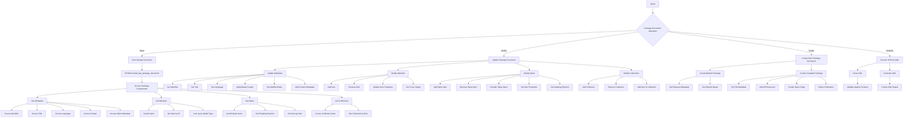

```mermaid
flowchart TD
    %% Main operations
    A[Client] --> B{Package Document Operation}

    %% Read operations
    B -->|Read| C1[Get Package Document]
    C1 --> D1[EPUBContainer.get_package_document]
    D1 --> E1[Access Package Components]

    E1 --> F1[Get Metadata]
    E1 --> F2[Get Manifest]
    E1 --> F3[Get Spine]
    E1 --> F4[Get Collections]

    F1 --> G1[Access Identifier]
    F1 --> G2[Access Title]
    F1 --> G3[Access Language]
    F1 --> G4[Access Creator]
    F1 --> G5[Access Other Metadata]

    F2 --> H1[Get All Items]
    F2 --> H2[Get Item by ID]
    F2 --> H3[Look up by Media Type]

    F3 --> I1[Get All Spine Items]
    F3 --> I2[Get Reading Direction]
    F3 --> I3[Get Item by idref]

    F4 --> J1[Access Collection Items]
    F4 --> J2[Get Collection by Role]

    %% Write operations
    B -->|Modify| C2[Update Package Document]
    C2 --> D2[Update Metadata]
    C2 --> D3[Modify Manifest]
    C2 --> D4[Modify Spine]
    C2 --> D5[Modify Collections]

    D2 --> K1[Set Identifier]
    D2 --> K2[Set Title]
    D2 --> K3[Set Language]
    D2 --> K4[Add/Update Creator]
    D2 --> K5[Set Modified Date]
    D2 --> K6[Add Custom Metadata]

    D3 --> L1[Add Item]
    D3 --> L2[Remove Item]
    D3 --> L3[Update Item Properties]
    D3 --> L4[Set Cover Image]

    D4 --> M1[Add Spine Item]
    D4 --> M2[Remove Spine Item]
    D4 --> M3[Reorder Spine Items]
    D4 --> M4[Set Item Properties]
    D4 --> M5[Set Reading Direction]

    D5 --> N1[Add Collection]
    D5 --> N2[Remove Collection]
    D5 --> N3[Add Item to Collection]

    %% Create operations
    B -->|Create| C3[Create New Package Document]
    C3 --> O1[Create Minimal Package]
    C3 --> O2[Create Complete Package]

    O1 --> P1[Set Required Metadata]
    O1 --> P2[Set Default Values]

    O2 --> Q1[Set Full Metadata]
    O2 --> Q2[Add All Resources]
    O2 --> Q3[Create Spine Order]
    O2 --> Q4[Define Collections]

    %% Convert operations
    B -->|Serialize| C4[Convert To/From XML]
    C4 --> R1[Parse XML]
    C4 --> R2[Generate XML]
    R1 --> S1[Validate Against Schema]
    R2 --> S2[Format XML Output]
```
