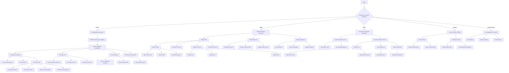

```mermaid
flowchart TD
    %% Main operations
    A[Client] --> B{Navigation Document Operation}

    %% Read operations
    B -->|Access| C1[Get Navigation Document]
    C1 --> D1[EPUBContainer.get_navigation]

    D1 --> E1[Access Navigation Components]

    E1 --> F1[Get Table of Contents]
    E1 --> F2[Get Page List]
    E1 --> F3[Get Landmarks]
    E1 --> F4[Get Other Nav Elements]

    F1 --> G1[Access TOC Structure]
    F1 --> G2[Get TOC Title]
    F1 --> G3[Get TOC Items]

    F2 --> H1[Access Page List Structure]
    F2 --> H2[Get Page List Title]
    F2 --> H3[Get Page List Items]

    F3 --> I1[Access Landmarks Structure]
    F3 --> I2[Get Landmarks Title]
    F3 --> I3[Get Landmarks Items]

    %% Item operations
    G3 --> J1[Get Nav Point Text]
    G3 --> J2[Get Nav Point Href]
    G3 --> J3[Get Nav Point Children]
    G3 --> J4[Get Nav Point Properties]

    %% Modify operations
    B -->|Modify| C2[Update Navigation Document]

    C2 --> K1[Modify TOC]
    C2 --> K2[Modify Page List]
    C2 --> K3[Modify Landmarks]

    K1 --> L1[Add TOC Item]
    K1 --> L2[Remove TOC Item]
    K1 --> L3[Update TOC Item]
    K1 --> L4[Reorder TOC Items]

    K2 --> M1[Add Page List Item]
    K2 --> M2[Remove Page List Item]
    K2 --> M3[Update Page List Item]

    K3 --> N1[Add Landmark]
    K3 --> N2[Remove Landmark]
    K3 --> N3[Update Landmark]

    L1 --> O1[Add to Root Level]
    L1 --> O2[Add as Child]
    L1 --> O3[Add with Properties]

    L3 --> P1[Update Text]
    L3 --> P2[Update Href]
    L3 --> P3[Update Type]

    %% Create operations
    B -->|Create| C3[Create New Navigation Document]

    C3 --> Q1[Create Minimal Nav Doc]
    C3 --> Q2[Create Complete Nav Doc]

    Q1 --> R1[Create Basic TOC]
    Q1 --> R2[Set Required Attributes]

    Q2 --> S1[Create TOC]
    Q2 --> S2[Create Page List]
    Q2 --> S3[Create Landmarks]

    S1 --> T1[Add Section Items]
    S1 --> T2[Add Nested Structure]

    S2 --> U1[Add Page Entries]

    S3 --> V1[Add Guide Landmarks]

    %% Convert operations
    B -->|Serialize| C4[Convert To/From XHTML]

    C4 --> W1[Parse XHTML]
    C4 --> W2[Generate XHTML]

    W1 --> X1[Extract Nav Elements]
    W1 --> X2[Map to Object Model]

    W2 --> Y1[Create Valid XHTML]
    W2 --> Y2[Set Required Namespaces]

    %% Additional operations
    B -->|Include in Spine| C5[Use Navigation in Content]

    C5 --> Z1[Add to Spine]
    C5 --> Z2[Style for Display]
    C5 --> Z3[Hide Sections]
```
