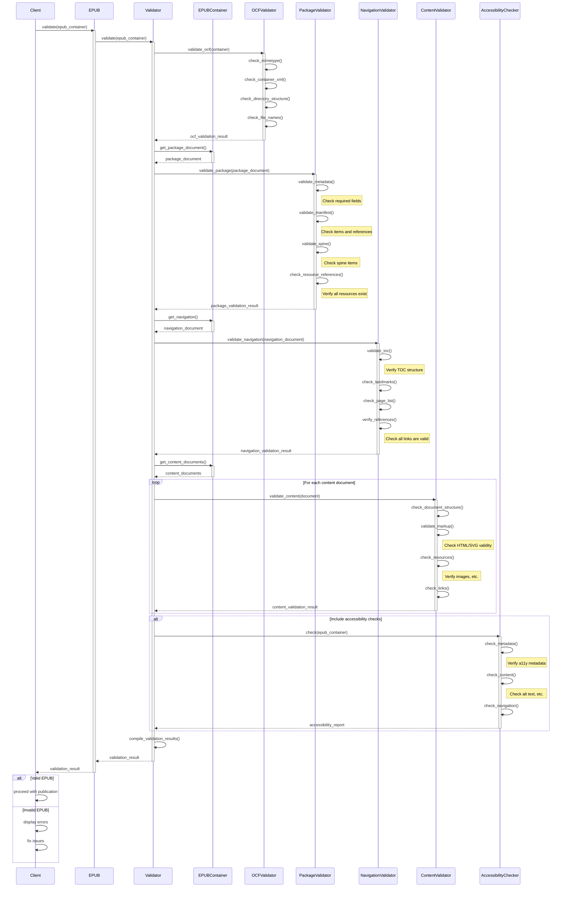

```mermaid
sequenceDiagram
    participant Client
    participant EPUB
    participant Validator
    participant EPUBContainer
    participant OCFValidator
    participant PackageValidator
    participant NavigationValidator
    participant ContentValidator
    participant AccessibilityChecker

    %% Main validation flow
    Client->>EPUB: validate(epub_container)
    activate EPUB
    EPUB->>Validator: validate(epub_container)
    activate Validator

    %% OCF validation
    Validator->>OCFValidator: validate_ocf(container)
    activate OCFValidator
    OCFValidator->>OCFValidator: check_mimetype()
    OCFValidator->>OCFValidator: check_container_xml()
    OCFValidator->>OCFValidator: check_directory_structure()
    OCFValidator->>OCFValidator: check_file_names()
    OCFValidator-->>Validator: ocf_validation_result
    deactivate OCFValidator

    %% Package validation
    Validator->>EPUBContainer: get_package_document()
    activate EPUBContainer
    EPUBContainer-->>Validator: package_document
    deactivate EPUBContainer

    Validator->>PackageValidator: validate_package(package_document)
    activate PackageValidator

    PackageValidator->>PackageValidator: validate_metadata()
    Note right of PackageValidator: Check required fields

    PackageValidator->>PackageValidator: validate_manifest()
    Note right of PackageValidator: Check items and references

    PackageValidator->>PackageValidator: validate_spine()
    Note right of PackageValidator: Check spine items

    PackageValidator->>PackageValidator: check_resource_references()
    Note right of PackageValidator: Verify all resources exist

    PackageValidator-->>Validator: package_validation_result
    deactivate PackageValidator

    %% Navigation validation
    Validator->>EPUBContainer: get_navigation()
    activate EPUBContainer
    EPUBContainer-->>Validator: navigation_document
    deactivate EPUBContainer

    Validator->>NavigationValidator: validate_navigation(navigation_document)
    activate NavigationValidator

    NavigationValidator->>NavigationValidator: validate_toc()
    Note right of NavigationValidator: Verify TOC structure

    NavigationValidator->>NavigationValidator: check_landmarks()

    NavigationValidator->>NavigationValidator: check_page_list()

    NavigationValidator->>NavigationValidator: verify_references()
    Note right of NavigationValidator: Check all links are valid

    NavigationValidator-->>Validator: navigation_validation_result
    deactivate NavigationValidator

    %% Content validation
    Validator->>EPUBContainer: get_content_documents()
    activate EPUBContainer
    EPUBContainer-->>Validator: content_documents
    deactivate EPUBContainer

    loop For each content document
        Validator->>ContentValidator: validate_content(document)
        activate ContentValidator

        ContentValidator->>ContentValidator: check_document_structure()

        ContentValidator->>ContentValidator: validate_markup()
        Note right of ContentValidator: Check HTML/SVG validity

        ContentValidator->>ContentValidator: check_resources()
        Note right of ContentValidator: Verify images, etc.

        ContentValidator->>ContentValidator: check_links()

        ContentValidator-->>Validator: content_validation_result
        deactivate ContentValidator
    end

    %% Accessibility checks (optional)
    alt Include accessibility checks
        Validator->>AccessibilityChecker: check(epub_container)
        activate AccessibilityChecker

        AccessibilityChecker->>AccessibilityChecker: check_metadata()
        Note right of AccessibilityChecker: Verify a11y metadata

        AccessibilityChecker->>AccessibilityChecker: check_content()
        Note right of AccessibilityChecker: Check alt text, etc.

        AccessibilityChecker->>AccessibilityChecker: check_navigation()

        AccessibilityChecker-->>Validator: accessibility_report
        deactivate AccessibilityChecker
    end

    %% Aggregate results
    Validator->>Validator: compile_validation_results()

    Validator-->>EPUB: validation_result
    deactivate Validator

    EPUB-->>Client: validation_result
    deactivate EPUB

    %% Client processing results
    alt Valid EPUB
        Client->>Client: proceed with publication
    else Invalid EPUB
        Client->>Client: display errors
        Client->>Client: fix issues
    end
```
