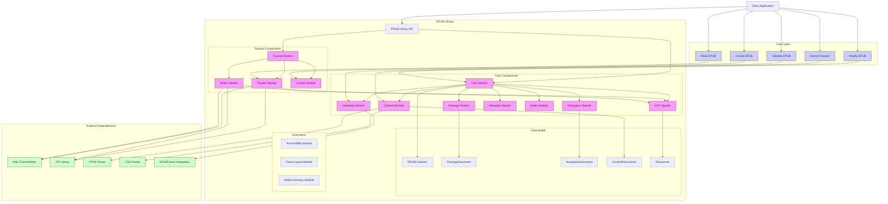

```mermaid
graph TD
    %% Main components
    Client[Client Application] --> EPUBAPI[EPUB Library API]

    subgraph "EPUB Library"
        EPUBAPI --> Core
        EPUBAPI --> Factory

        %% Core components
        subgraph "Core Components"
            Core[Core Module]
            Core --> OCF[OCF Module]
            Core --> Package[Package Module]
            Core --> Navigation[Navigation Module]
            Core --> Content[Content Module]
            Core --> Metadata[Metadata Module]
            Core --> Media[Media Module]
            Core --> Validation[Validation Module]
        end

        %% Factory components
        subgraph "Factory Components"
            Factory[Factory Module]
            Factory --> Reader[Reader Module]
            Factory --> Writer[Writer Module]
            Factory --> Creator[Creator Module]
        end

        %% Data components
        subgraph "Data Model"
            Container[EPUBContainer]
            PackageDoc[PackageDocument]
            NavDoc[NavigationDocument]
            ContentDocs[ContentDocuments]
            Resources[Resources]
        end

        %% Extensions
        subgraph "Extensions"
            Accessibility[Accessibility Module]
            FixedLayout[Fixed Layout Module]
            MediaOverlays[Media Overlays Module]
        end
    end

    %% External dependencies
    subgraph "External Dependencies"
        XML[XML Parser/Writer]
        ZIP[ZIP Library]
        HTML[HTML Parser]
        CSS[CSS Parser]
        EPUBCheck[EPUBCheck Integration]
    end

    %% Component relationships
    Core --> Container
    Package --> PackageDoc
    Navigation --> NavDoc
    Content --> ContentDocs
    OCF --> Resources

    Reader --> OCF
    Reader --> XML
    Reader --> ZIP

    Writer --> OCF
    Writer --> XML
    Writer --> ZIP

    Content --> HTML
    Content --> CSS

    Validation --> EPUBCheck

    %% Use cases
    subgraph "Use Cases"
        ReadEPUB[Read EPUB]
        CreateEPUB[Create EPUB]
        ModifyEPUB[Modify EPUB]
        ValidateEPUB[Validate EPUB]
        ExtractContent[Extract Content]
    end

    %% Use case connections
    ReadEPUB --> Reader
    CreateEPUB --> Creator
    ModifyEPUB --> Core
    ValidateEPUB --> Validation
    ExtractContent --> Content

    %% Client uses cases connections
    Client --> ReadEPUB
    Client --> CreateEPUB
    Client --> ModifyEPUB
    Client --> ValidateEPUB
    Client --> ExtractContent

    %% Style and notes
    classDef component fill:#f9f,stroke:#333,stroke-width:1px;
    classDef usecase fill:#ccf,stroke:#333,stroke-width:1px;
    classDef external fill:#cfc,stroke:#333,stroke-width:1px;

    class Core,Package,Navigation,Content,OCF,Metadata,Media,Validation component;
    class Factory,Reader,Writer,Creator component;
    class ReadEPUB,CreateEPUB,ModifyEPUB,ValidateEPUB,ExtractContent usecase;
    class XML,ZIP,HTML,CSS,EPUBCheck external;
```
