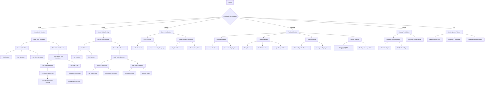

```mermaid
flowchart TD
    %% Main operations
    A[Client] --> B{Media Overlay Operation}

    %% Read operations
    B -->|Parse| C1[Parse Media Overlay]
    C1 --> D1[Read SMIL Document]
    D1 --> E1[Extract Metadata]
    D1 --> E2[Extract Media Elements]

    E1 --> F1[Get Duration]
    E1 --> F2[Get Narrators]
    E1 --> F3[Get Other Metadata]

    E2 --> G1[Parse Parallel Time Containers]
    G1 --> H1[Link Text Fragments]
    G1 --> H2[Link Audio Clips]

    H1 --> I1[Parse Text References]
    I1 --> J1[Connect to Content Document]

    H2 --> I2[Parse Audio References]
    I2 --> J2[Connect to Audio Files]

    %% Create operations
    B -->|Create| C2[Create Media Overlay]
    C2 --> D2[Create SMIL Structure]
    D2 --> K1[Set Metadata]
    D2 --> K2[Create Time Containers]

    K1 --> L1[Set Duration]
    K1 --> L2[Set Narrators]

    K2 --> M1[Add Parallel Elements]
    M1 --> N1[Add Text Reference]
    M1 --> N2[Add Audio Reference]

    N1 --> O1[Set Fragment ID]
    N1 --> O2[Set Content Document]

    N2 --> P1[Set Audio Source]
    N2 --> P2[Set Clip Times]

    %% Connect operations
    B -->|Connect| C3[Connect to Content]
    C3 --> Q1[Link to Package]
    C3 --> Q2[Link to Content Documents]

    Q1 --> R1[Add to Manifest]
    Q1 --> R2[Set media-overlay Property]

    Q2 --> S1[Map Text Elements]
    Q2 --> S2[Create Timing Map]

    %% Playback operations
    B -->|Playback| C4[Playback Control]
    C4 --> T1[Initialize Playback]
    C4 --> T2[Control Playback]
    C4 --> T3[Skip Navigation]
    C4 --> T4[Escape Features]

    T1 --> U1[Load Audio Files]
    T1 --> U2[Setup Text Highlighting]

    T2 --> V1[Play/Pause]
    T2 --> V2[Seek to Position]
    T2 --> V3[Adjust Playback Rate]

    T3 --> W1[Detect Skippable Structures]
    T3 --> W2[Configure Skip Options]

    T4 --> X1[Detect Escapable Structures]
    T4 --> X2[Configure Escape Options]

    %% Styling operations
    B -->|Styling| C5[Manage Text Styling]
    C5 --> Y1[Configure Text Highlighting]
    C5 --> Y2[Configure Active Classes]

    Y1 --> Z1[Set Active Style]
    Y1 --> Z2[Set Playback Style]

    %% TTS operations
    B -->|TTS| C6[Text-to-Speech Fallback]
    C6 --> AA1[Detect Missing Audio]
    C6 --> AA2[Configure TTS Engine]
    C6 --> AA3[Generate Synthetic Speech]
```
