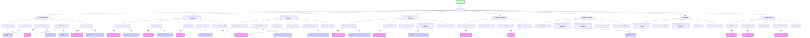

```mermaid
graph TD
    %% Main use cases based on PRD.txt requirements

    %% Actors
    Developer[Developer] -->|Uses| EPUBLib[EPUB Library]

    %% Main use case groups
    EPUBLib --> Container[Container Handling]
    EPUBLib --> Package[Package Document Operations]
    EPUBLib --> Navigation[Navigation Document Operations]
    EPUBLib --> Content[Content Document Operations]
    EPUBLib --> Metadata[Metadata Management]
    EPUBLib --> Validation[Validation Operations]
    EPUBLib --> Creation[Creation API]
    EPUBLib --> Advanced[Advanced Features]

    %% Container Handling
    Container --> Container1[Read EPUB Container]
    Container --> Container2[Extract Resources]
    Container --> Container3[Create EPUB Container]
    Container --> Container4[Write EPUB Container]
    Container --> Container5[Access Resources]

    %% Package Document
    Package --> Package1[Parse Package Document]
    Package --> Package2[Modify Manifest]
    Package --> Package3[Modify Spine]
    Package --> Package4[Handle Collections]
    Package --> Package5[Generate Package XML]

    %% Navigation Document
    Navigation --> Navigation1[Parse Navigation Document]
    Navigation --> Navigation2[Extract Table of Contents]
    Navigation --> Navigation3[Extract Page List]
    Navigation --> Navigation4[Extract Landmarks]
    Navigation --> Navigation5[Create/Modify Navigation]
    Navigation --> Navigation6[Support Legacy NCX]

    %% Content Document
    Content --> Content1[Parse Content Documents]
    Content --> Content2[Extract Text/Media]
    Content --> Content3[Handle Internal Links]
    Content --> Content4[Manage External Resources]
    Content --> Content5[Create Content Documents]

    %% Metadata
    Metadata --> Metadata1[Manage Required Metadata]
    Metadata --> Metadata2[Manage Optional Metadata]
    Metadata --> Metadata3[Handle Custom Metadata]
    Metadata --> Metadata4[Support Link Elements]

    %% Validation
    Validation --> Validation1[Validate EPUB Structure]
    Validation --> Validation2[Validate Package Document]
    Validation --> Validation3[Validate Content Documents]
    Validation --> Validation4[Check Integrity of Links]
    Validation --> Validation5[Integrate with EPUBCheck]

    %% Creation API
    Creation --> Creation1[Create New EPUB from Content]
    Creation --> Creation2[Add Resources to EPUB]
    Creation --> Creation3[Generate Navigation Document]
    Creation --> Creation4[Set Metadata]
    Creation --> Creation5[Organize Content in Spine]

    %% Advanced Features
    Advanced --> Advanced1[Media Overlays]
    Advanced --> Advanced2[Fixed Layout Support]
    Advanced --> Advanced3[Font Obfuscation]
    Advanced --> Advanced4[Accessibility Validation]
    Advanced --> Advanced5[CFI Support]

    %% Specific implementations with API from HIGH_LEVEL_API.md

    %% Container use cases
    Container1 -->|uses| EPUB:::api
    Container1 -->|via| EPUB.open:::method

    Container3 -->|uses| EPUB:::api
    Container3 -->|via| EPUB.create:::method

    Container4 -->|uses| EPUB:::api
    Container4 -->|via| EPUB.write:::method

    Container5 -->|uses| EPUBContainer:::api
    Container5 -->|via| EPUBContainer.get_resource:::method

    %% Package document use cases
    Package1 -->|uses| PackageDocument:::api
    Package1 -->|via| PackageDocument.parse:::method

    Package2 -->|uses| EPUBManifest:::api
    Package2 -->|via| EPUBManifest.add_item:::method

    Package3 -->|uses| EPUBSpine:::api
    Package3 -->|via| EPUBSpine.add_item:::method

    %% Navigation document use cases
    Navigation1 -->|uses| NavigationDocument:::api
    Navigation1 -->|via| EPUBContainer.get_navigation:::method

    Navigation5 -->|uses| NavigationDocument:::api
    Navigation5 -->|via| NavigationDocument.add_nav_point:::method

    %% Content document use cases
    Content1 -->|uses| ContentDocument:::api
    Content1 -->|via| EPUBContainer.get_content_document:::method

    Content2 -->|uses| XHTMLDocument:::api
    Content2 -->|via| XHTMLDocument.query_selector_all:::method

    %% Metadata use cases
    Metadata1 -->|uses| EPUBMetadata:::api

    %% Validation use cases
    Validation1 -->|uses| Validator:::api
    Validation1 -->|via| EPUB.validate:::method

    %% Advanced features
    Advanced1 -->|uses| MediaOverlay:::api
    Advanced2 -->|uses| LayoutManager:::api
    Advanced4 -->|uses| AccessibilityChecker:::api

    %% Styling classes
    classDef api fill:#f9f,stroke:#333,stroke-width:2px;
    classDef method fill:#ccf,stroke:#333,stroke-width:1px;
    classDef actor fill:#cfc,stroke:#333,stroke-width:2px;

    class Developer actor;
```
